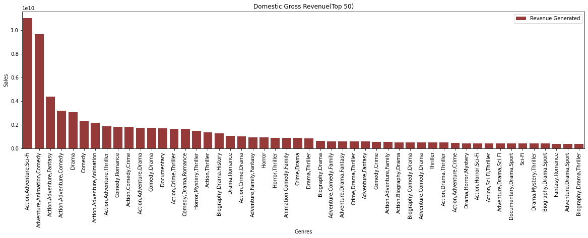
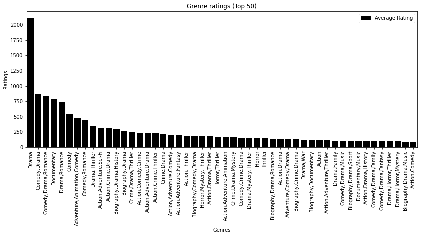
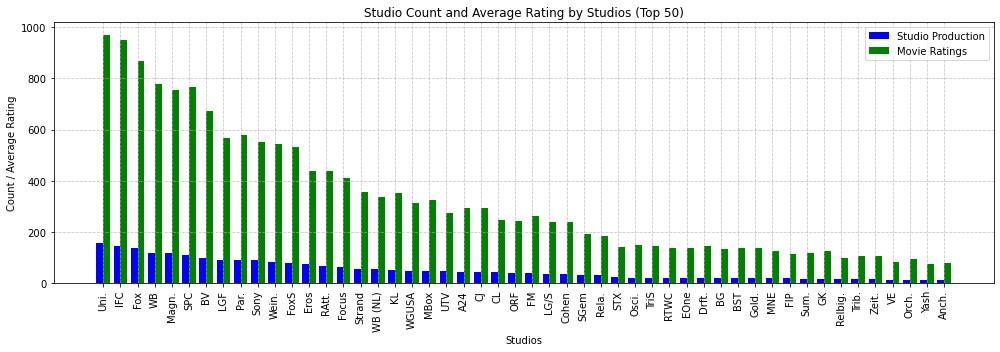
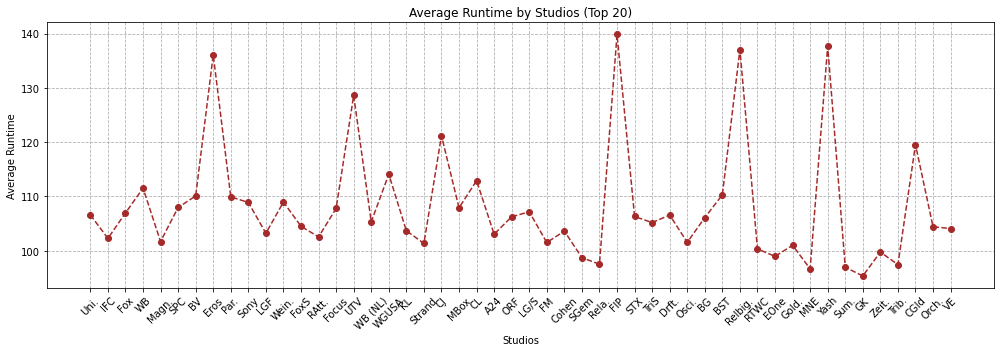
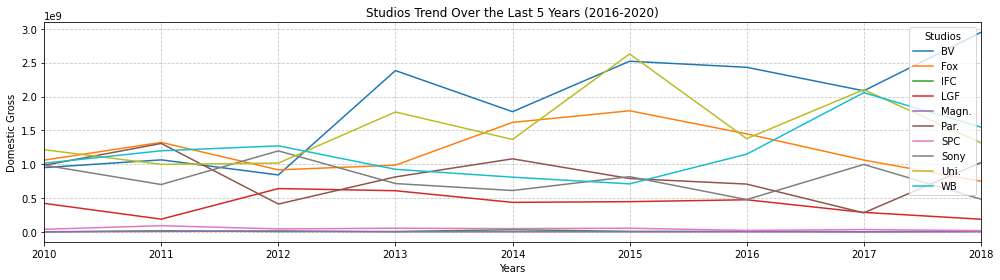
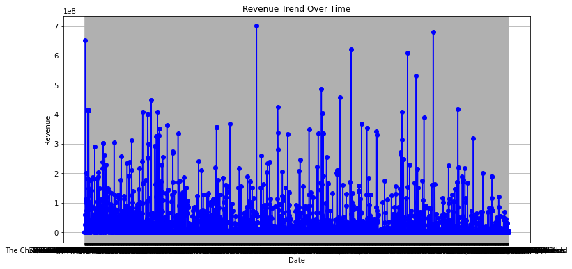

<h1 style="font-size: 40px;">MS STUDIOS MARKET LANDSCAPE ANALYSYS</h1>
 
 
     
<h1 style="font-size: 18px;">Overview</h1>

This project analyses the understanding of the market landscape needed to by Microsoft to start a new movie studio, which looks to secure a portion of the market that is already dominated by the existing movie produces and eventually become the leading studio. Exploratory analysis of the movies produced, the ratings, the genre the sales/revenue, the market capture among the existing movie producers and the average runtime of the movies being produced. The MS studios can use this analysis to understand their immediate market to inform decision making as they build one of the leading movie studios, MS STUDIOS. 

<h1 style="font-size: 18px;">Business Problem</h1>

Microsoft sees all the big companies creating original video content and they want to get in on the fun. They have decided to create a new movie studio, but they don’t know anything about creating movies. You are charged with exploring what types of films are currently doing the best at the box office. You must then translate those findings into actionable insights that the head of Microsoft's new movie studio can use to help decide what type of films to create. 

 <h1 style="font-size: 18px;">Understanding the data</h1>
 
The data is from IMDB Web site that provides information about multiple movies, films, and TV programs. This data has consistent updates and its reliable based on the background research I undertaken. This data will assist me in getting insights that will enable me advice Microsoft on what movies to start with when starting their new movie production. The data also speaks to movie length and sales made by movies and the respective producers who represent the market competition.

<h1 style="font-size: 18px;">Methods and Results</h1>
Qn. Based on genre, What type of movies generate the most revenues and what’s the relationship of the movie rating to sales?

A combination of action, adventure and Sci-Fi perform better in revenue generation as compared to the other sets of diversifications of films. This is closely followed by a combination of action, adventure & comedy and at third place action, adventure & fantasy. With this trend it is ok to conclude that films with both action and adventure combined in one set does well in sales generation. 

 When it comes to the production of the films, pure drama as a genre is the most produced amongst all genres followed by a combination of comedy & drama. At this point its easy to conclude that production has no impact on sales as many people buy a combination of action, adventure, and Sci-Fi as opposed to the most produced, drama.

Qn. Which competitor has the highest production rate and highest movie ratings in the market?

The graph indicates direct proportionality of production and movie rating. In this market, the company producing the most movies also receive the most movie rating hence the popularity. This graph is clear on market occupation based on production capacity. The production rate is at below 200 movies per company within the past few years. The production capacity is a key thing to focus on while creating movies. 

Qn. What is the average movie runtime per company?

The average runtime of each movie differs per company with the most producing movies having an average runtime of less than 110 minutes. Generally, most competitors have their average runtime per movie below the mentioned mark. This can change based on the demands in the market and/or based on the subsequent ratings and feedback. The preferred runtime of a movie is between 80-110 minutes. 

Qn. What is the sales per studio in the past 5 yeas?

The graph above analyses the market trends of 10 companies in the last 9 years. It shows the companies with the top sales within those and indicates the possible competition in the market. most of the graphs have an irregular trend, an indication that the movie market is not stable, and fluctuations are anticipated.  

Sales Over time

Within the years the sales trend has been irregular with alot of flactuations per company over the years

<h1 style="font-size: 18px;">Conclusion</h1>

• Microsoft can conduct direct surveys on the target market and potential competitors to assist them in producing based on the immediate customer needs.

• The movie runtime is key as the preferred time for a movie is about 80 to 110 minutes. Based on the data most people prefer this range of watching time and this will also inform production

•  While most studio focus on producing drama, the company can start with Action & adventure which is the combination that generates most sales compared to the other genre. 

• Bring onboard an experienced producer who understands the market trend and can combine different movie genres in one film.

• Understand and satisfy the target market.

<h1 style="font-size: 18px;">Next Steps</h1>

Further analyses could yield additional insights to further improve oversight on movie production as the market keeps on changing and competition increasing. 

• Better prediction of movie sale with resent dataset would really inform recent market trends and could shade light on the upcoming companies. 

• This Microsoft could also benefit from customer surveys to better understand the market and the preference of the customers in the immediate. 

• The company also needs insights from different movie producers who understand the movie production landscape and ecosystem.

• This modelling could identify the specific genre of movie targeting a specific group of people and staying consistent to it.

<h1 style="font-size: 14px;">Contact Information</h1>

Name: Amadi Growman

Email:amadi.growman@student.moringaschool.com 
    