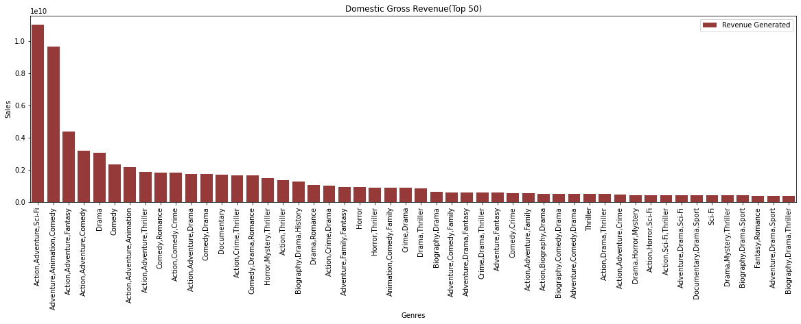
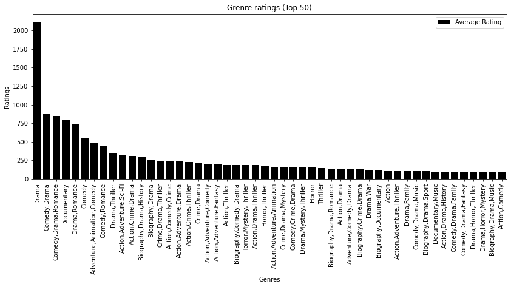
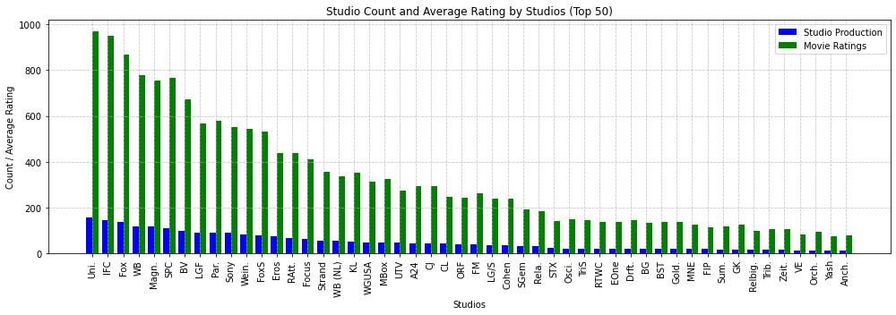
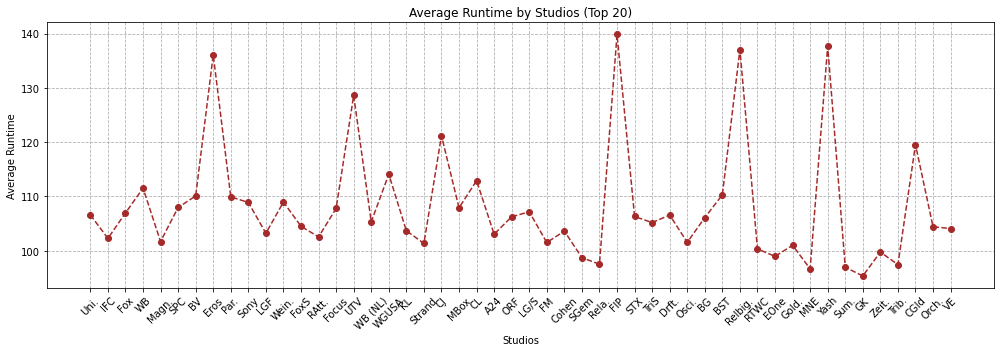
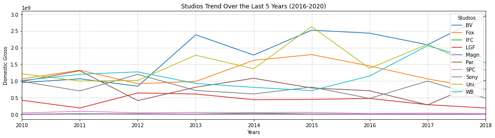

# PH1-Project

MS STUDIOS MARKET LANDSCAPE ANALYSYS
 ```python ``` 
Overview
This project analyzes the understanding of the market landscape needed to by Microsoft to start a new movie studio, which looks to secure a portion of the market that is already dominated by the existing movie produces and eventually become the leading studio. Exploratory analysis of the movies produced, the ratings, the genre the sales/revenue, the market capture among the existing movie producers and the average runtime of the movies being produced. The MS studios can use this analysis to undestand their immidiate market to inform decision making as they build one of the leading movie studios, MS STUDIOS. 
Business Problem
Microsoft sees all the big companies creating original video content and they want to get in on the fun. They have decided to create a new movie studio, but they don’t know anything about creating movies. You are charged with exploring what types of films are currently doing the best at the box office. You must then translate those findings into actionable insights that the head of Microsoft's new movie studio can use to help decide what type of films to create. ```python #loading the relevant libraries import pandas as pd import numpy as np import matplotlib.pyplot as plt %matplotlib inline import seaborn as sns ``` 
Loading the 1st dataset, 'bom.movie_gross.csv'
```python #loading the 1st dataset to pandas dataframe and calling the first 6 rows df1 = pd.read_csv('bom.movie_gross.csv') df1.head(6) ``` 

title
studio
domestic_gross
foreign_gross
year
0
Toy Story 3
BV
415000000.0
652000000
2010
1
Alice in Wonderland (2010)
BV
334200000.0
691300000
2010
2
Harry Potter and the Deathly Hallows Part 1
WB
296000000.0
664300000
2010
3
Inception
WB
292600000.0
535700000
2010
4
Shrek Forever After
P/DW
238700000.0
513900000
2010
5
The Twilight Saga: Eclipse
Sum.
300500000.0
398000000
2010
```python #Getting the information on the 1st dataset df1.info() ``` RangeIndex: 3387 entries, 0 to 3386 Data columns (total 5 columns): # Column Non-Null Count Dtype --- ------ -------------- ----- 0 title 3387 non-null object 1 studio 3382 non-null object 2 domestic_gross 3359 non-null float64 3 foreign_gross 2037 non-null object 4 year 3387 non-null int64 dtypes: float64(1), int64(1), object(3) memory usage: 132.4+ KB From the result we have 3 data types objects, integer and floats. We need to change the data types for 'foreign_gross' and 'year' columns to float and datetime respectivety ```python #setting errors parameter to 'coerce' to change to NaN any value that can't change to numeric df1['foreign_gross']= pd.to_numeric(df1['foreign_gross'], errors='coerce') #changing the year to datetime df1['year']=pd.to_datetime(df1['year'],format='%Y') ``` ```python #Checking for the changes sfter changing column datatypes df1.info() ``` RangeIndex: 3387 entries, 0 to 3386 Data columns (total 5 columns): # Column Non-Null Count Dtype --- ------ -------------- ----- 0 title 3387 non-null object 1 studio 3382 non-null object 2 domestic_gross 3359 non-null float64 3 foreign_gross 2032 non-null float64 4 year 3387 non-null datetime64[ns] dtypes: datetime64[ns](1), float64(2), object(2) memory usage: 132.4+ KB ```python #Checking missing data for every column df1.isna().sum() ``` title 0 studio 5 domestic_gross 28 foreign_gross 1355 year 0 dtype: int64 studio is missing 5 data pionts, domestic_gross is missing 28 datapoints and foreign_gross is missing 1350 datapoints I will be replacing the values in studio and domestic_gross column and dropping the foreign_gross column because the amount of data missing is significant to the analysis 
Data cleaning, 1st dataset
```python # Replacing the missing values under the studio column with "NA" df1['studio'] = df1['studio'].fillna('NA') # Replacing the domestiv_gross with the median df1['domestic_gross'].fillna(df1['domestic_gross'].median(), inplace=True) #dropping the foreign_gross column df1.drop(columns=['foreign_gross'], inplace=True) ``` ```python #cheking the changes on the columns based on the missing data df1.isna().sum() ``` title 0 studio 0 domestic_gross 0 year 0 dtype: int64 ```python df1 ``` 

title
studio
domestic_gross
year
0
Toy Story 3
BV
415000000.0
2010-01-01
1
Alice in Wonderland (2010)
BV
334200000.0
2010-01-01
2
Harry Potter and the Deathly Hallows Part 1
WB
296000000.0
2010-01-01
3
Inception
WB
292600000.0
2010-01-01
4
Shrek Forever After
P/DW
238700000.0
2010-01-01
...
...
...
...
...
3382
The Quake
Magn.
6200.0
2018-01-01
3383
Edward II (2018 re-release)
FM
4800.0
2018-01-01
3384
El Pacto
Sony
2500.0
2018-01-01
3385
The Swan
Synergetic
2400.0
2018-01-01
3386
An Actor Prepares
Grav.
1700.0
2018-01-01
3387 rows × 4 columns
Loading the 2nd dataset 'title.basics.csv'
```python #loading the second data into the pandas dataframe df2= pd.read_csv('title.basics.csv') df2.head(6) ``` 

tconst
primary_title
original_title
start_year
runtime_minutes
genres
0
tt0063540
Sunghursh
Sunghursh
2013
175.0
Action,Crime,Drama
1
tt0066787
One Day Before the Rainy Season
Ashad Ka Ek Din
2019
114.0
Biography,Drama
2
tt0069049
The Other Side of the Wind
The Other Side of the Wind
2018
122.0
Drama
3
tt0069204
Sabse Bada Sukh
Sabse Bada Sukh
2018
NaN
Comedy,Drama
4
tt0100275
The Wandering Soap Opera
La Telenovela Errante
2017
80.0
Comedy,Drama,Fantasy
5
tt0111414
A Thin Life
A Thin Life
2018
75.0
Comedy
```python ##Getting the information on the 2nd dataset df2.info() ``` RangeIndex: 146144 entries, 0 to 146143 Data columns (total 6 columns): # Column Non-Null Count Dtype --- ------ -------------- ----- 0 tconst 146144 non-null object 1 primary_title 146144 non-null object 2 original_title 146123 non-null object 3 start_year 146144 non-null int64 4 runtime_minutes 114405 non-null float64 5 genres 140736 non-null object dtypes: float64(1), int64(1), object(4) memory usage: 6.7+ MB The column Data types for the 2nd dataset are object,integer and float We have 146144 row and 6 colums 
Data cleaning, the 2nd Dataset
```python #changing the year to datetime df2['start_year']=pd.to_datetime(df2['start_year'],format='%Y') ``` ```python #checking the missing data in all the colums df2.isna().sum() ``` tconst 0 primary_title 0 original_title 21 start_year 0 runtime_minutes 31739 genres 5408 dtype: int64 ```python #checking the statistical information of the column(s) with datatype integer df2.describe() ``` 

runtime_minutes
count
114405.000000
mean
86.187247
std
166.360590
min
1.000000
25%
70.000000
50%
87.000000
75%
99.000000
max
51420.000000
```python # using median to replace the missing values df2['runtime_minutes'].fillna(df2['runtime_minutes'].median(), inplace=True) #replacing the missing values under original_title with NA df2['original_title'] = df2['original_title'].fillna('NA') #replacing the missing values in genre with NA df2['genres'] = df2['genres'].fillna('NA') ``` I used median to replace the missing values in the column runtime_minutes because the median is has less effect on the variance of the dataset compared to the means ```python #checking the chenges after replacing df2.isna().sum() ``` tconst 0 primary_title 0 original_title 0 start_year 0 runtime_minutes 0 genres 0 dtype: int64 ```python df2.head(6) ``` 

tconst
primary_title
original_title
start_year
runtime_minutes
genres
0
tt0063540
Sunghursh
Sunghursh
2013-01-01
175.0
Action,Crime,Drama
1
tt0066787
One Day Before the Rainy Season
Ashad Ka Ek Din
2019-01-01
114.0
Biography,Drama
2
tt0069049
The Other Side of the Wind
The Other Side of the Wind
2018-01-01
122.0
Drama
3
tt0069204
Sabse Bada Sukh
Sabse Bada Sukh
2018-01-01
87.0
Comedy,Drama
4
tt0100275
The Wandering Soap Opera
La Telenovela Errante
2017-01-01
80.0
Comedy,Drama,Fantasy
5
tt0111414
A Thin Life
A Thin Life
2018-01-01
75.0
Comedy
Loading the third dataset, 'title.ratings.csv'
```python # loading the data into pandas df3= pd.read_csv('title.ratings.csv') df3.head(6) ``` 

tconst
averagerating
numvotes
0
tt10356526
8.3
31
1
tt10384606
8.9
559
2
tt1042974
6.4
20
3
tt1043726
4.2
50352
4
tt1060240
6.5
21
5
tt1069246
6.2
326
```python #getting the information of the dataset df3.info() ``` RangeIndex: 73856 entries, 0 to 73855 Data columns (total 3 columns): # Column Non-Null Count Dtype --- ------ -------------- ----- 0 tconst 73856 non-null object 1 averagerating 73856 non-null float64 2 numvotes 73856 non-null int64 dtypes: float64(1), int64(1), object(1) memory usage: 1.7+ MB ```python #checking the missing values df3.isna().sum() ``` tconst 0 averagerating 0 numvotes 0 dtype: int64 
The data df3 has no missing values
Merging the 3 datasets (df1,df2 and df3)
```python # merging Df2 and df3 with the key being tconst column df2_df3 = pd.merge(df2, df3, on='tconst', how='inner') df2_df3 ``` 

tconst
primary_title
original_title
start_year
runtime_minutes
genres
averagerating
numvotes
0
tt0063540
Sunghursh
Sunghursh
2013-01-01
175.0
Action,Crime,Drama
7.0
77
1
tt0066787
One Day Before the Rainy Season
Ashad Ka Ek Din
2019-01-01
114.0
Biography,Drama
7.2
43
2
tt0069049
The Other Side of the Wind
The Other Side of the Wind
2018-01-01
122.0
Drama
6.9
4517
3
tt0069204
Sabse Bada Sukh
Sabse Bada Sukh
2018-01-01
87.0
Comedy,Drama
6.1
13
4
tt0100275
The Wandering Soap Opera
La Telenovela Errante
2017-01-01
80.0
Comedy,Drama,Fantasy
6.5
119
...
...
...
...
...
...
...
...
...
73851
tt9913084
Diabolik sono io
Diabolik sono io
2019-01-01
75.0
Documentary
6.2
6
73852
tt9914286
Sokagin Çocuklari
Sokagin Çocuklari
2019-01-01
98.0
Drama,Family
8.7
136
73853
tt9914642
Albatross
Albatross
2017-01-01
87.0
Documentary
8.5
8
73854
tt9914942
La vida sense la Sara Amat
La vida sense la Sara Amat
2019-01-01
87.0
NA
6.6
5
73855
tt9916160
Drømmeland
Drømmeland
2019-01-01
72.0
Documentary
6.5
11
73856 rows × 8 columns
```python df2_df3.info() ``` Int64Index: 73856 entries, 0 to 73855 Data columns (total 8 columns): # Column Non-Null Count Dtype --- ------ -------------- ----- 0 tconst 73856 non-null object 1 primary_title 73856 non-null object 2 original_title 73856 non-null object 3 start_year 73856 non-null datetime64[ns] 4 runtime_minutes 73856 non-null float64 5 genres 73856 non-null object 6 averagerating 73856 non-null float64 7 numvotes 73856 non-null int64 dtypes: datetime64[ns](1), float64(2), int64(1), object(4) memory usage: 5.1+ MB ```python #changing the column name from primary_title to title to enable inner merging of df2_df3 and df1 df2_df3= df2_df3.rename(columns={'primary_title': 'title'}) df2_df3 ``` 

tconst
title
original_title
start_year
runtime_minutes
genres
averagerating
numvotes
0
tt0063540
Sunghursh
Sunghursh
2013-01-01
175.0
Action,Crime,Drama
7.0
77
1
tt0066787
One Day Before the Rainy Season
Ashad Ka Ek Din
2019-01-01
114.0
Biography,Drama
7.2
43
2
tt0069049
The Other Side of the Wind
The Other Side of the Wind
2018-01-01
122.0
Drama
6.9
4517
3
tt0069204
Sabse Bada Sukh
Sabse Bada Sukh
2018-01-01
87.0
Comedy,Drama
6.1
13
4
tt0100275
The Wandering Soap Opera
La Telenovela Errante
2017-01-01
80.0
Comedy,Drama,Fantasy
6.5
119
...
...
...
...
...
...
...
...
...
73851
tt9913084
Diabolik sono io
Diabolik sono io
2019-01-01
75.0
Documentary
6.2
6
73852
tt9914286
Sokagin Çocuklari
Sokagin Çocuklari
2019-01-01
98.0
Drama,Family
8.7
136
73853
tt9914642
Albatross
Albatross
2017-01-01
87.0
Documentary
8.5
8
73854
tt9914942
La vida sense la Sara Amat
La vida sense la Sara Amat
2019-01-01
87.0
NA
6.6
5
73855
tt9916160
Drømmeland
Drømmeland
2019-01-01
72.0
Documentary
6.5
11
73856 rows × 8 columns
```python #Checking the infomation of the new data df2_df3 df2_df3.info() ``` Int64Index: 73856 entries, 0 to 73855 Data columns (total 8 columns): # Column Non-Null Count Dtype --- ------ -------------- ----- 0 tconst 73856 non-null object 1 title 73856 non-null object 2 original_title 73856 non-null object 3 start_year 73856 non-null datetime64[ns] 4 runtime_minutes 73856 non-null float64 5 genres 73856 non-null object 6 averagerating 73856 non-null float64 7 numvotes 73856 non-null int64 dtypes: datetime64[ns](1), float64(2), int64(1), object(4) memory usage: 5.1+ MB ```python #merging our new data df2_df3 with the first data(df1) df1_df2_df3 = df2_df3.merge(df1, on='title', how='inner') df1_df2_df3 ``` 

tconst
title
original_title
start_year
runtime_minutes
genres
averagerating
numvotes
studio
domestic_gross
year
0
tt0315642
Wazir
Wazir
2016-01-01
103.0
Action,Crime,Drama
7.1
15378
Relbig.
1100000.0
2016-01-01
1
tt0337692
On the Road
On the Road
2012-01-01
124.0
Adventure,Drama,Romance
6.1
37886
IFC
744000.0
2012-01-01
2
tt4339118
On the Road
On the Road
2014-01-01
89.0
Drama
6.0
6
IFC
744000.0
2012-01-01
3
tt5647250
On the Road
On the Road
2016-01-01
121.0
Drama
5.7
127
IFC
744000.0
2012-01-01
4
tt0359950
The Secret Life of Walter Mitty
The Secret Life of Walter Mitty
2013-01-01
114.0
Adventure,Comedy,Drama
7.3
275300
Fox
58200000.0
2013-01-01
...
...
...
...
...
...
...
...
...
...
...
...
3022
tt8331988
The Chambermaid
La camarista
2018-01-01
102.0
Drama
7.1
147
FM
300.0
2015-01-01
3023
tt8404272
How Long Will I Love U
Chao shi kong tong ju
2018-01-01
101.0
Romance
6.5
607
WGUSA
747000.0
2018-01-01
3024
tt8427036
Helicopter Eela
Helicopter Eela
2018-01-01
135.0
Drama
5.4
673
Eros
72000.0
2018-01-01
3025
tt9078374
Last Letter
Ni hao, Zhihua
2018-01-01
114.0
Drama,Romance
6.4
322
CL
181000.0
2018-01-01
3026
tt9151704
Burn the Stage: The Movie
Burn the Stage: The Movie
2018-01-01
84.0
Documentary,Music
8.8
2067
Trafalgar
4200000.0
2018-01-01
3027 rows × 11 columns
```python # checking the information of our new dataset df1_df2_df3.info() ``` Int64Index: 3027 entries, 0 to 3026 Data columns (total 11 columns): # Column Non-Null Count Dtype --- ------ -------------- ----- 0 tconst 3027 non-null object 1 title 3027 non-null object 2 original_title 3027 non-null object 3 start_year 3027 non-null datetime64[ns] 4 runtime_minutes 3027 non-null float64 5 genres 3027 non-null object 6 averagerating 3027 non-null float64 7 numvotes 3027 non-null int64 8 studio 3027 non-null object 9 domestic_gross 3027 non-null float64 10 year 3027 non-null datetime64[ns] dtypes: datetime64[ns](2), float64(3), int64(1), object(5) memory usage: 283.8+ KB ```python df1_df2_df3['runtime_minutes']= pd.to_numeric(df1_df2_df3['runtime_minutes'], errors='coerce') ``` ```python #Checking for missing values in our new dataset df1_df2_df3.isna().sum() ``` title 0 runtime_minutes 0 genres 0 averagerating 0 numvotes 0 studio 0 domestic_gross 0 year 0 dtype: int64 ```python #droping less useful columns df1_df2_df3 =df1_df2_df3.drop(['tconst','original_title','start_year'], axis=1) df1_df2_df3 ``` 

title
runtime_minutes
genres
averagerating
numvotes
studio
domestic_gross
year
0
Wazir
103.0
Action,Crime,Drama
7.1
15378
Relbig.
1100000.0
2016-01-01
1
On the Road
124.0
Adventure,Drama,Romance
6.1
37886
IFC
744000.0
2012-01-01
2
On the Road
89.0
Drama
6.0
6
IFC
744000.0
2012-01-01
3
On the Road
121.0
Drama
5.7
127
IFC
744000.0
2012-01-01
4
The Secret Life of Walter Mitty
114.0
Adventure,Comedy,Drama
7.3
275300
Fox
58200000.0
2013-01-01
...
...
...
...
...
...
...
...
...
3022
The Chambermaid
102.0
Drama
7.1
147
FM
300.0
2015-01-01
3023
How Long Will I Love U
101.0
Romance
6.5
607
WGUSA
747000.0
2018-01-01
3024
Helicopter Eela
135.0
Drama
5.4
673
Eros
72000.0
2018-01-01
3025
Last Letter
114.0
Drama,Romance
6.4
322
CL
181000.0
2018-01-01
3026
Burn the Stage: The Movie
84.0
Documentary,Music
8.8
2067
Trafalgar
4200000.0
2018-01-01
3027 rows × 8 columns
```python #discriptive stats for columns with floats and integer datatypes df1_df2_df3.describe() ``` 

runtime_minutes
averagerating
numvotes
domestic_gross
count
3027.000000
3027.000000
3.027000e+03
3.027000e+03
mean
106.903204
6.457582
6.170030e+04
3.042782e+07
std
20.073663
1.012277
1.255132e+05
6.651972e+07
min
3.000000
1.600000
5.000000e+00
1.000000e+02
25%
93.000000
5.900000
2.117000e+03
1.445000e+05
50%
104.000000
6.600000
1.310900e+04
1.900000e+06
75%
118.000000
7.100000
6.276550e+04
3.210000e+07
max
272.000000
9.200000
1.841066e+06
7.001000e+08
Analysis
Qn. Based on genre, What type of movies generate the most revenues and whats the relationship of the movie rating to sales?
```python #grouping data by genre for plotting grouped_genres = df1_df2_df3.groupby('genres')[['averagerating', 'domestic_gross']].sum() #arranging the grouped averagerating data in decending order and viewing the 1st 10 rows grouped_genres_AVR = grouped_genres.sort_values(by=['averagerating'], ascending=False) #greating a viariable to hold the 1st 10 grouped_averagerating= grouped_genres_AVR.head(50) grouped_averagerating ``` 

averagerating
domestic_gross
genres


Drama
2115.3
3.049094e+09
Comedy,Drama
876.3
1.731282e+09
Comedy,Drama,Romance
838.2
1.673457e+09
Documentary
793.6
1.698565e+09
Drama,Romance
743.8
1.048307e+09
Comedy
550.4
2.359043e+09
Adventure,Animation,Comedy
482.9
9.645133e+09
Comedy,Romance
437.8
1.848823e+09
Drama,Thriller
348.0
8.291860e+08
Action,Adventure,Sci-Fi
318.5
1.102470e+10
Action,Crime,Drama
313.5
1.014720e+09
Biography,Drama,History
305.0
1.275551e+09
Biography,Drama
260.7
6.343661e+08
Crime,Drama,Thriller
247.1
5.837515e+08
Action,Comedy,Crime
239.4
1.812073e+09
Action,Adventure,Drama
238.4
1.754973e+09
Action,Crime,Thriller
230.9
1.673869e+09
Crime,Drama
222.2
8.752390e+08
Action,Adventure,Comedy
200.7
3.172472e+09
Action,Adventure,Fantasy
194.9
4.378787e+09
Action,Thriller
189.3
1.376548e+09
Biography,Comedy,Drama
187.7
5.154836e+08
Horror,Mystery,Thriller
187.6
1.485928e+09
Action,Drama,Thriller
183.4
4.926565e+08
Horror,Thriller
173.1
8.981199e+08
Action,Adventure,Animation
161.8
2.184660e+09
Crime,Drama,Mystery
160.4
2.362010e+08
Comedy,Crime,Drama
152.8
3.052481e+08
Drama,Mystery,Thriller
152.4
4.072563e+08
Horror
150.9
9.152155e+08
Thriller
149.0
5.048964e+08
Biography,Drama,Romance
133.2
1.067863e+08
Action,Drama
131.5
2.296982e+08
Adventure,Comedy,Drama
130.2
5.069452e+08
Biography,Crime,Drama
129.1
3.733352e+08
Drama,War
123.9
3.652040e+07
Biography,Documentary
121.8
8.884750e+07
Action
110.1
1.858607e+08
Action,Adventure,Thriller
110.1
1.851798e+09
Drama,Family
107.6
2.749483e+08
Comedy,Drama,Music
107.6
3.342780e+08
Biography,Drama,Sport
102.7
4.043210e+08
Documentary,Music
100.5
1.200013e+08
Action,Drama,History
98.1
3.376473e+08
Comedy,Drama,Family
96.5
2.436273e+08
Comedy,Drama,Fantasy
95.4
2.626540e+07
Drama,Horror,Thriller
93.7
3.065075e+08
Drama,Horror,Mystery
93.6
4.411679e+08
Biography,Drama,Music
92.9
3.309563e+08
Action,Comedy
91.5
1.777839e+08
```python #arranging the domestic_gross data in decending order and viewing the 1st 10 rows grouped_genres_DG = grouped_genres.sort_values(by=['domestic_gross'], ascending=False) #greating a viariable to hold the 1st 10 grouped_domestic_gross=grouped_genres_DG.head(50) grouped_domestic_gross ``` 

averagerating
domestic_gross
genres


Action,Adventure,Sci-Fi
318.5
1.102470e+10
Adventure,Animation,Comedy
482.9
9.645133e+09
Action,Adventure,Fantasy
194.9
4.378787e+09
Action,Adventure,Comedy
200.7
3.172472e+09
Drama
2115.3
3.049094e+09
Comedy
550.4
2.359043e+09
Action,Adventure,Animation
161.8
2.184660e+09
Action,Adventure,Thriller
110.1
1.851798e+09
Comedy,Romance
437.8
1.848823e+09
Action,Comedy,Crime
239.4
1.812073e+09
Action,Adventure,Drama
238.4
1.754973e+09
Comedy,Drama
876.3
1.731282e+09
Documentary
793.6
1.698565e+09
Action,Crime,Thriller
230.9
1.673869e+09
Comedy,Drama,Romance
838.2
1.673457e+09
Horror,Mystery,Thriller
187.6
1.485928e+09
Action,Thriller
189.3
1.376548e+09
Biography,Drama,History
305.0
1.275551e+09
Drama,Romance
743.8
1.048307e+09
Action,Crime,Drama
313.5
1.014720e+09
Adventure,Family,Fantasy
48.9
9.235000e+08
Horror
150.9
9.152155e+08
Horror,Thriller
173.1
8.981199e+08
Animation,Comedy,Family
45.0
8.753285e+08
Crime,Drama
222.2
8.752390e+08
Drama,Thriller
348.0
8.291860e+08
Biography,Drama
260.7
6.343661e+08
Adventure,Comedy,Family
67.1
5.915000e+08
Adventure,Drama,Fantasy
34.2
5.894000e+08
Crime,Drama,Thriller
247.1
5.837515e+08
Adventure,Fantasy
21.5
5.787000e+08
Comedy,Crime
71.9
5.419985e+08
Action,Adventure,Family
28.2
5.336000e+08
Action,Biography,Drama
77.5
5.230889e+08
Biography,Comedy,Drama
187.7
5.154836e+08
Adventure,Comedy,Drama
130.2
5.069452e+08
Thriller
149.0
5.048964e+08
Action,Drama,Thriller
183.4
4.926565e+08
Action,Adventure,Crime
77.5
4.744504e+08
Drama,Horror,Mystery
93.6
4.411679e+08
Action,Horror,Sci-Fi
40.1
4.391000e+08
Action,Sci-Fi,Thriller
48.2
4.237000e+08
Adventure,Drama,Sci-Fi
16.6
4.164000e+08
Documentary,Drama,Sport
14.0
4.134500e+08
Sci-Fi
10.1
4.126780e+08
Drama,Mystery,Thriller
152.4
4.072563e+08
Biography,Drama,Sport
102.7
4.043210e+08
Fantasy,Romance
12.8
4.010430e+08
Adventure,Drama,Sport
6.2
4.007000e+08
Biography,Drama,Thriller
64.1
3.986880e+08
```python #Ploting the most profitable, the most popular and the most produced genre plt.figure(figsize=(20, 5)) # Set the figure size (optional) # Plot the grouped data sns.barplot(x=grouped_domestic_gross.index, y='domestic_gross', data=grouped_domestic_gross, label='Revenue Generated',color='brown') # Customize the plot plt.xlabel('Genres') plt.ylabel('Sales') plt.title('Domestic Gross Revenue(Top 50)') # Rotate x-axis labels for better readability plt.xticks(rotation= 90) plt.legend() # Show the plot plt.show() #Ploting the most profitable, the most popular and the most produced genre plt.figure(figsize=(14, 5)) # Set the figure size (optional) # Plot the grouped data sns.barplot(x=grouped_averagerating.index, y='averagerating', data=grouped_averagerating, label='Average Rating',color='Black') # Customize the plot plt.xlabel('Genres') plt.ylabel('Ratings') plt.title('Grenre ratings (Top 50)') # Rotate x-axis labels for better readability plt.xticks(rotation= 90) plt.legend() # Show the plot plt.show() ```   Films combining action,adventure and Sci-Fi perform better in revenue generation as compared to the other sets of diversification of filims. This is closely followed by a combination of action,adventure & comedy and at third place action,adventure & fantacy. With this trend it is ok to conclude that films with bothaction and adventure in them performs better in revenues/sales when combined with other genres of films in a single movie When it comes to the production of the filims, pure drama as a genre is the most produced amongest all genres followed by a combination of comedy & drama. At this point its easy to conclude that production has no impact on sales as many people buy a combination of action,adventure and Sci-Fi 
Qn. Which competitor has the highest production rate and higest movie ratings in the market?
```python df1_df2_df3['studio'].value_counts() ``` Uni. 156 IFC 145 Fox 138 WB 119 Magn. 117 ... AR 1 FOAK 1 Dreamwest 1 Trafalgar 1 EXCL 1 Name: studio, Length: 217, dtype: int64 ```python #getting the count of the studios Studio_count = df1_df2_df3['studio'].value_counts() #grouping by studio studios_AVR = df1_df2_df3.groupby('studio')[['averagerating']].sum() studios_AV_count = pd.merge(studios_AVR, Studio_count, left_index=True, right_index=True) studios_AV_count = studios_AV_count.rename(columns={'studio': 'count'}) #sorting in descending by studio studios_AV_count= studios_AV_count.sort_values(by='count', ascending=False) Grouped_data=studios_AV_count.head(50) Grouped_data ``` 

averagerating
count
Uni.
970.5
156
IFC
951.6
145
Fox
868.5
138
WB
778.1
119
Magn.
753.2
117
SPC
767.4
110
BV
671.2
97
LGF
567.4
91
Par.
577.4
90
Sony
551.9
89
Wein.
544.9
81
FoxS
531.7
79
Eros
439.9
76
RAtt.
437.2
68
Focus
410.8
62
Strand
356.9
54
WB (NL)
335.6
54
KL
353.0
53
WGUSA
311.4
49
MBox
324.5
48
UTV
274.3
48
A24
293.5
45
CJ
294.5
44
CL
248.7
43
ORF
244.5
39
FM
263.6
39
LG/S
238.3
37
Cohen
239.4
36
SGem
192.4
32
Rela.
182.4
31
STX
143.1
23
Osci.
148.1
22
TriS
145.9
22
RTWC
137.6
21
EOne
135.9
21
Drft.
145.0
21
BG
133.1
21
BST
137.7
20
Gold.
137.7
20
MNE
124.1
20
FIP
112.2
19
Sum.
117.1
18
GK
124.8
17
Relbig.
97.1
16
Trib.
107.7
16
Zeit.
108.1
16
VE
81.7
14
Orch.
96.1
14
Yash
76.6
13
Anch.
77.9
13
```python # Set the figure size plt.figure(figsize=(14,5)) # Define the width of the bars bar_width =0.4 # Define the positions of the bars x = range(len(Grouped_data)) # Create a bar for studio count plt.bar(x, Grouped_data['count'], width=bar_width, label='Studio Production', color='blue') # Create a bar for studio rating plt.bar([i + bar_width for i in x], Grouped_data['averagerating'], width=bar_width, label='Movie Ratings', color='green') # Set the x-axis labels as studio names plt.xticks([i + bar_width/2 for i in x], Grouped_data.index, rotation=90) # Add labels and title plt.xlabel('Studios') plt.ylabel('Count / Average Rating') plt.title('Studio Count and Average Rating by Studios (Top 50)') # Add a legend plt.legend() # Show the plot plt.grid(True, linestyle='--', alpha=0.7) plt.tight_layout() plt.show() ```  The graph indicates direct proportionality of production and movie rating. In this market, the company producing the most movies also recieves the most movie rating hence the popularity. This graph is clear on market occupation based on production capacity. the production rate is at below 200 movies per company within the past few years. The production capacity is a key thing to focus on while creating movies 
Qn. What is the average movie runtime per company?
```python #grouping runtime_minutes by studio studios_runtime = df1_df2_df3.groupby('studio')['runtime_minutes'].sum() studios_runtime_count = pd.merge(studios_runtime, Studio_count, left_index=True, right_index=True) studios_runtime_DSC = studios_runtime_count.sort_values(by='runtime_minutes', ascending=False) #getting the mean runtime per studio and sorting by studio studios_runtime_DSC['average_runtime'] = studios_runtime_DSC['runtime_minutes'] / studios_runtime_DSC['studio'] studios_runtime_DSC.head(20) Top_studios_runtime_DSC ``` 

runtime_minutes
studio
average_runtime
Uni.
16630.0
156
106.602564
IFC
14830.0
145
102.275862
Fox
14758.0
138
106.942029
WB
13272.0
119
111.529412
Magn.
11898.0
117
101.692308
SPC
11876.0
110
107.963636
BV
10679.0
97
110.092784
Eros
10343.0
76
136.092105
Par.
9893.0
90
109.922222
Sony
9691.0
89
108.887640
LGF
9393.0
91
103.219780
Wein.
8826.0
81
108.962963
FoxS
8255.0
79
104.493671
RAtt.
6973.0
68
102.544118
Focus
6683.0
62
107.790323
UTV
6173.0
48
128.604167
WB (NL)
5687.0
54
105.314815
WGUSA
5590.0
49
114.081633
KL
5495.0
53
103.679245
Strand
5472.0
54
101.333333
```python studios = studios_runtime_DSC.index[:50] # Get the studio names for the top 20 average_runtimes = studios_runtime_DSC['average_runtime'][:50] # Get the corresponding average runtimes # Create a line graph plt.figure(figsize=(14, 5)) plt.plot(studios, average_runtimes, marker='o', linestyle='--', color='brown') # Set the x-axis labels as studio names plt.xticks(rotation=45) # Add labels and title plt.xlabel('Studios') plt.ylabel('Average Runtime') plt.title('Average Runtime by Studios (Top 20)') # Show the plot plt.grid(True, linestyle='--') plt.tight_layout() plt.show() ```  The average runtime of each movie differ per company with the most producing movies having an average runtime of less than 110 minutes. Generaly most competitors have their averager runtime per filim below the mentioned mark. This can change based on the demands in the market and/or based on the subsequent ratings and feedback 
Qn. What is the sales per studio in the past 5 yeas?
```python # Convert the end_year to a datetime object end_year = pd.to_datetime('2020-01-01') # Filter data for the last 5 years (up to 2020) filtered_data = df1_df2_df3[df1_df2_df3['year'] <= end_year] # Calculate the top 20 studios based on their count in the 'studio' column top_studios = filtered_data['studio'].value_counts().nlargest(5).index # Filter data to include only the top 20 studios filtered_data = filtered_data[filtered_data['studio'].isin(top_studios)] # Group data by 'year' and 'studio' and sum 'domestic_gross' grouped_data = filtered_data.groupby(['year', 'studio'])['domestic_gross'].sum().unstack() # Plot the data plt.figure(figsize=(14, 4)) grouped_data.plot(kind='line', ax=plt.gca()) # Add labels and title plt.xlabel('Years') plt.ylabel('Domestic Gross') plt.title('Studios Trend Over the Last 5 Years (2016-2020)') # Show the plot plt.legend(title='Studios') plt.grid(True, linestyle='--', alpha=0.7) plt.tight_layout() plt.show() ```  The graph above analyses the market trends of 10 companies in the last 9 years. It shows the companies with the top sales within those and also indicates the possible competition in the market. most of the graphs have an irregular trend, an indication that the movie market is not stable and flactuations are anticipeted ```python # Create the line plot plt.figure(figsize=(12, 6)) plt.plot(df1_df2_df3['year'], df1_df2_df3['domestic_gross'], marker='o', linestyle='-', color='b') plt.title('Revenue Trend Over Time') plt.xlabel('Date') plt.ylabel('Revenue') plt.grid(True) plt.show() ``` ![png](output_
